# Navigation_flutter
<table>
<tr>
    <th>Nama</th>
    <td>Stefanus Ageng Budi Utomo</td>
</tr>
<tr>
    <th>NIM</th>
    <td>2241720126</td>
</tr>
<tr>
    <th>Kelas</th>
    <td>TI 3G</td>
</tr>
<tr>
    <th>Topik</th>
    <td>Layout dan Navigasi</td>
</tr>
</table>
<br>

# Report
# Praktikum 5: Membangun Navigasi di Flutter

## Langkah 1: Siapkan project baru
Sebelum melanjutkan praktikum, buatlah sebuah project baru Flutter dengan nama belanja dan susunan folder seperti pada gambar berikut. Penyusunan ini dimaksudkan untuk mengorganisasi kode dan widget yang lebih mudah.

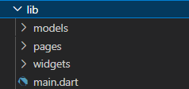

## Langkah 2: Mendefinisikan Route
Buatlah dua buah file dart dengan nama `home_page.dart` dan `item_page.dart` pada folder **pages**. Untuk masing-masing file, deklarasikan `class HomePage` pada file `home_page.dart` dan `ItemPage` pada `item_page.dart`. Turunkan class dari `StatelessWidget`. Gambaran potongan kode dapat anda lihat sebagai berikut.

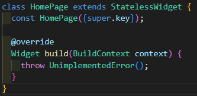
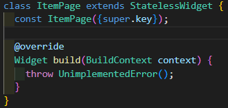

<!-- `home_page.dart`
``` dart
import 'package:flutter/material.dart';

class HomePage extends StatelessWidget {
  const HomePage({super.key});

  @override
  Widget build(BuildContext context) {
    throw UnimplementedError();
  }
}
```

`ItemPage`
``` dart
import 'package:flutter/material.dart';

class ItemPage extends StatelessWidget {
  const ItemPage({super.key});

  @override
  Widget build(BuildContext context) {
    throw UnimplementedError();
  }
}
``` -->

### Langkah 3: Lengkapi Kode di main.dart
Setelah kedua halaman telah dibuat dan didefinisikan, bukalah file `main.dart`. Pada langkah ini anda akan mendefinisikan Route untuk kedua halaman tersebut. Definisi penamaan **route** harus bersifat **unique**. Halaman **HomePage** didefinisikan sebagai /. Dan halaman **ItemPage** didefinisikan sebagai **/item**. Untuk mendefinisikan halaman awal, anda dapat menggunakan `named argument initialRoute`. Gambaran tahapan ini, dapat anda lihat pada potongan kode berikut.

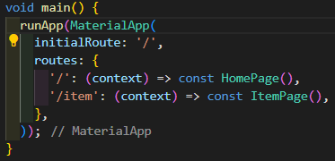

<!-- ``` dart
void main() {
  runApp(MaterialApp(
    initialRoute: '/',
    routes: {
      '/': (context) => HomePage(),
      '/item': (context) => ItemPage(),
    },
  ));
}
``` -->

### Langkah 4: Membuat data model
Sebelum melakukan perpindahan halaman dari `HomePage` ke `ItemPage`, dibutuhkan proses pemodelan data. Pada desain mockup, dibutuhkan dua informasi yaitu nama dan harga. Untuk menangani hal ini, buatlah sebuah file dengan nama `item.dart` dan letakkan pada folder models. Pada file ini didefinisikan pemodelan data yang dibutuhkan. Ilustrasi kode yang dibutuhkan, dapat anda lihat pada potongan kode berikut.

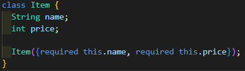

### Langkah 5: Lengkapi kode di class HomePage
Pada halaman `HomePage` terdapat `ListView` widget. Sumber data `ListView` diambil dari model List dari object Item. Gambaran kode yang dibutuhkan untuk melakukan definisi model dapat anda lihat sebagai berikut.

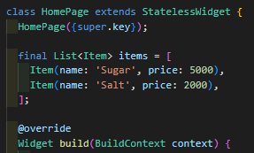

### Langkah 6: Membuat ListView dan itemBuilder
Untuk menampilkan `ListView` pada praktikum ini digunakan `itemBuilder`. Data diambil dari definisi model yang telah dibuat sebelumnya. Untuk menunjukkan batas data satu dan berikutnya digunakan widget `Card`. Kode yang telah umum pada bagian ini tidak ditampilkan. Gambaran kode yang dibutuhkan dapat anda lihat sebagai berikut.

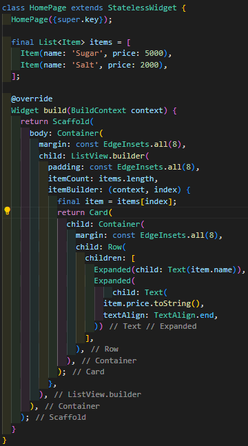

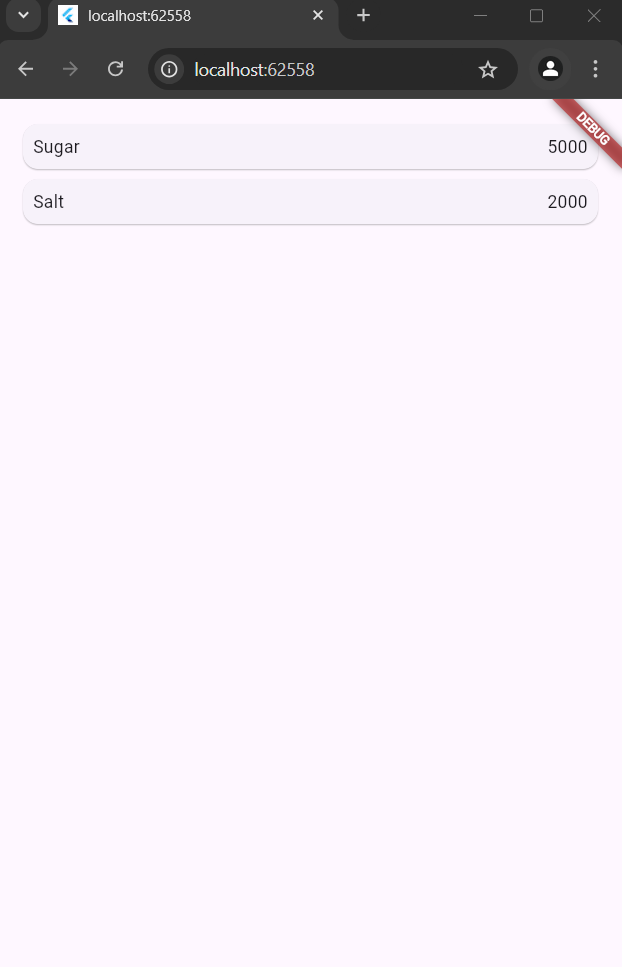

### Langkah 7: Menambahkan aksi pada ListView
Item pada ListView saat ini ketika ditekan masih belum memberikan aksi tertentu. Untuk menambahkan aksi pada ListView dapat digunakan widget `InkWell` atau `GestureDetector`. Perbedaan utamanya `InkWell` merupakan material widget yang memberikan efek ketika ditekan. Sedangkan `GestureDetector` bersifat umum dan bisa juga digunakan untuk gesture lain selain sentuhan. Pada praktikum ini akan digunakan widget `InkWell`.

Untuk menambahkan sentuhan, letakkan cursor pada widget pembuka `Card`. Kemudian gunakan shortcut quick fix dari VSCode (**Ctrl +** . pada Windows atau **Cmd +** . pada MacOS). Sorot menu `wrap with widget ...` Ubah nilai widget menjadi `InkWell` serta tambahkan named argument onTap yang berisi fungsi untuk berpindah ke halaman `ItemPage`.

# Tugas Praktikum
1. Untuk melakukan pengiriman data ke halaman berikutnya, cukup menambahkan informasi arguments pada penggunaan `Navigator`. Perbarui kode pada bagian `Navigator` menjadi seperti berikut.
``` dart
Navigator.pushNamed(context, '/item', arguments: item);
```

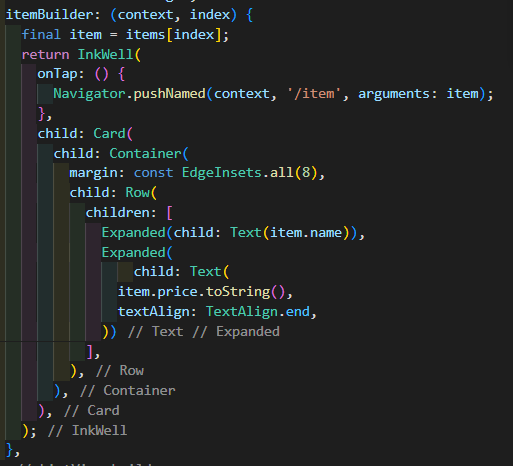

2. Pembacaan nilai yang dikirimkan pada halaman sebelumnya dapat dilakukan menggunakan `ModalRoute`. Tambahkan kode berikut pada blok fungsi build dalam halaman `ItemPage`. Setelah nilai didapatkan, anda dapat menggunakannya seperti penggunaan variabel pada umumnya. (https://docs.flutter.dev/cookbook/navigation/navigate-with-arguments)
``` dart
final itemArgs = ModalRoute.of(context)!.settings.arguments as Item;
```

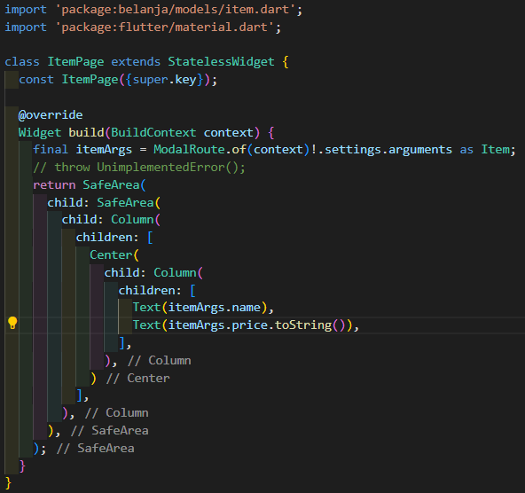

3. Pada hasil akhir dari aplikasi **belanja** yang telah anda selesaikan, tambahkan atribut foto produk, stok, dan rating. Ubahlah tampilan menjadi `GridView` seperti di aplikasi marketplace pada umumnya.

`item.dart`
``` dart
class Item {
  String name;
  int price;
  String photo;
  int stock;
  double rating;

  Item({
    required this.name,
    required this.price,
    required this.photo,
    required this.stock,
    required this.rating,
  });
}
```

`homepage.dart`
``` dart
import 'package:belanja/models/item.dart';
import 'package:flutter/material.dart';

class HomePage extends StatelessWidget {
  HomePage({super.key});

  final List<Item> items = [
    Item(
      name: 'Sugar',
      price: 5000,
      photo:
          'https://encrypted-tbn0.gstatic.com/images?q=tbn:ANd9GcQvt91vTsohXj07VmirArZpFzGRUBw8hritcg&s',
      stock: 16,
      rating: 4.8,
    ),
    Item(
      name: 'Salt',
      price: 2000,
      photo:
          'https://encrypted-tbn0.gstatic.com/images?q=tbn:ANd9GcS673pW3rqS3mIPR4sHi-NTeOJPLhLXCwPx8A&s',
      stock: 10,
      rating: 4.9,
    ),
  ];

  @override
  Widget build(BuildContext context) {
    return Scaffold(
      appBar: AppBar(
        title: const Text(
          'Groceries',
          style: TextStyle(
            color: Colors.white,
            fontWeight: FontWeight.bold,
          ),
        ),
        backgroundColor: Colors.green,
      ),
      body: Container(
        margin: const EdgeInsets.all(8),
        child: GridView.builder(
          gridDelegate: const SliverGridDelegateWithFixedCrossAxisCount(
              crossAxisCount: 2),
          padding: const EdgeInsets.all(8),
          itemCount: items.length,
          itemBuilder: (context, index) {
            final item = items[index];
            return InkWell(
              onTap: () {
                Navigator.pushNamed(context, '/item', arguments: item);
              },
              child: Card(
                child: Container(
                  margin: const EdgeInsets.all(8),
                  child: Column(
                    children: [
                      Image.network(item.photo),
                      Text(item.name),
                      Text('Rp. ${item.price}'),
                      Text('Stock: ${item.stock}'),
                      Text('Rating: ${item.rating}'),
                    ],
                  ),
                ),
              ),
            );
          },
        ),
      ),
    );
  }
}
```

4. Silakan implementasikan Hero widget pada aplikasi belanja Anda dengan mempelajari dari sumber ini: https://docs.flutter.dev/cookbook/navigation/hero-animations

`homepage.dart`
``` dart
import 'package:belanja/models/item.dart';
import 'package:flutter/material.dart';

class HomePage extends StatelessWidget {
  HomePage({super.key});

  final List<Item> items = [
    Item(
      name: 'Sugar',
      price: 5000,
      photo:
          'https://encrypted-tbn0.gstatic.com/images?q=tbn:ANd9GcQvt91vTsohXj07VmirArZpFzGRUBw8hritcg&s',
      stock: 16,
      rating: 4.8,
    ),
    Item(
      name: 'Salt',
      price: 2000,
      photo:
          'https://encrypted-tbn0.gstatic.com/images?q=tbn:ANd9GcS673pW3rqS3mIPR4sHi-NTeOJPLhLXCwPx8A&s',
      stock: 10,
      rating: 4.9,
    ),
  ];

  @override
  Widget build(BuildContext context) {
    return Scaffold(
      appBar: AppBar(
        title: const Text(
          'Groceries',
          style: TextStyle(
            color: Colors.white,
            fontWeight: FontWeight.bold,
          ),
        ),
        backgroundColor: Colors.green,
      ),
      body: Container(
        margin: const EdgeInsets.all(8),
        child: GridView.builder(
          gridDelegate: const SliverGridDelegateWithFixedCrossAxisCount(
              crossAxisCount: 2),
          padding: const EdgeInsets.all(8),
          itemCount: items.length,
          itemBuilder: (context, index) {
            final item = items[index];
            return InkWell(
              onTap: () {
                Navigator.pushNamed(context, '/item', arguments: item);
              },
              child: Card(
                child: Container(
                  margin: const EdgeInsets.all(8),
                  child: Column(
                    crossAxisAlignment: CrossAxisAlignment.start,
                    children: [
                      SizedBox(
                        width: double.infinity,
                        height: 120,
                        child: Hero(
                          tag: item.name,
                          child: Image.network(
                            item.photo,
                            fit: BoxFit.cover,
                          ),
                        ),
                      ),
                      const SizedBox(height: 8),
                      Text(item.name),
                      Text('Rp ${item.price}'),
                      Text('Stock: ${item.stock}'),
                      Text('Rating: ${item.rating}'),
                    ],
                  ),
                ),
              ),
            );
          },
        ),
      ),
    );
  }
}
```
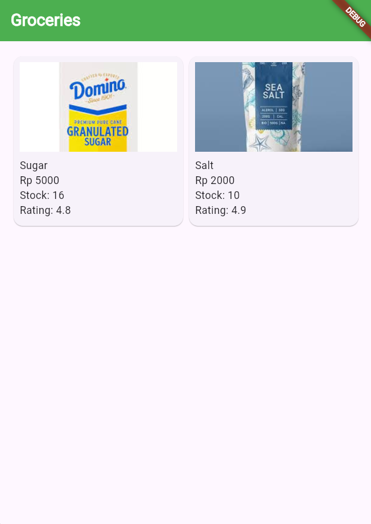
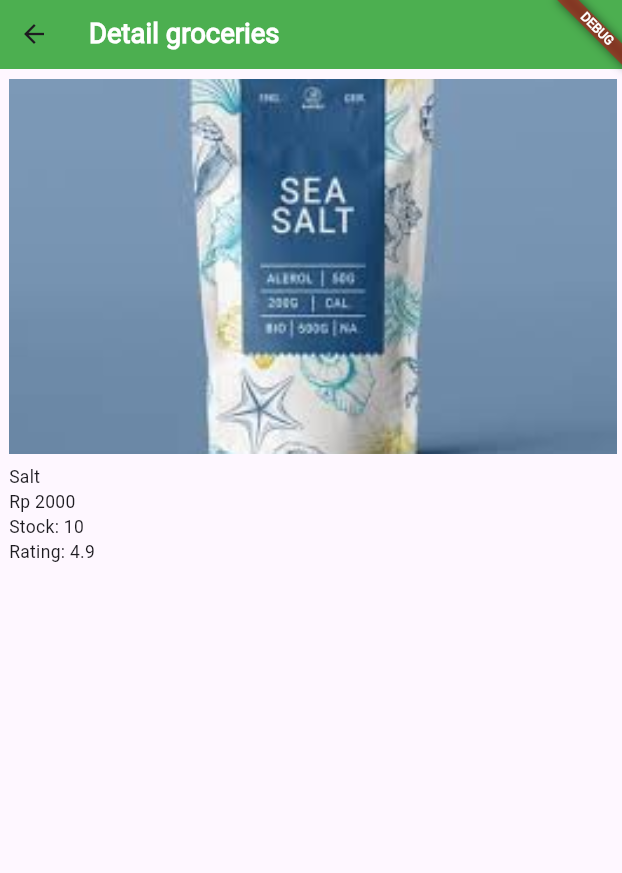

5. Sesuaikan dan modifikasi tampilan sehingga menjadi aplikasi yang menarik. Selain itu, pecah widget menjadi kode yang lebih kecil. Tambahkan Nama dan NIM di footer aplikasi belanja Anda.

sebelum method build `homepage`
``` dart
Widget footerSection = Container(
  width: double.infinity,
  color: Colors.green,
  padding: const EdgeInsets.all(10),
  alignment: Alignment.center,
  child: const Text(
    'Stefanus Ageng Budi Utomo - 2241720126',
    style: TextStyle(fontWeight: FontWeight.bold, color: Colors.white),
  ),
);
```

didalam method build `homepage`
``` dart
body: Column(
  children: [
    Expanded('/////'),
    footerSection,
  ]
)
```

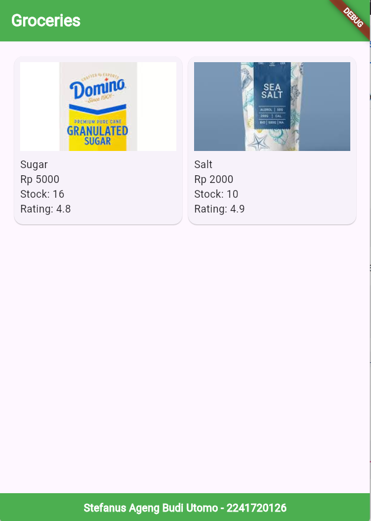

6. Selesaikan Praktikum 5: Navigasi dan Rute tersebut. Cobalah modifikasi menggunakan plugin go_router, lalu dokumentasikan dan push ke repository Anda berupa screenshot setiap hasil pekerjaan beserta penjelasannya di file README.md. Kumpulkan link commit repository GitHub Anda kepada dosen yang telah disepakati!

`pubspec.yaml`
``` yaml
depedependencies:
  flutter:
    sdk: flutter
  go_router: ^14.3.0
```

`homepage.dart`
``` dart
import 'package:go_router/go_router.dart';
/ / /
```
sebelumnya
``` dart
InkWell(
  onTap: () {
    Navigator.pushNamed(context, '/item', arguments: item);
  },
)
```
menjadi
``` dart
InkWell(
  onTap: () {
    context.go('/item', extra: item);
  },
)
```

`main.dart`
``` dart
import 'package:belanja/models/item.dart';
import 'package:belanja/pages/homepage.dart';
import 'package:belanja/pages/item_page.dart';
import 'package:flutter/material.dart';
import 'package:go_router/go_router.dart';

void main() {
  // runApp(MaterialApp(
  //   initialRoute: '/',
  //   routes: {
  //     '/': (context) => HomePage(),
  //     '/item': (context) => const ItemPage(),
  //   },
  // ));
  runApp(MaterialApp.router(
    routerConfig: _router,
  ));
}

GoRouter _router = GoRouter(routes: [
  GoRoute(
    path: '/',
    builder: (context, state) => HomePage(),
  ),
  GoRoute(
    path: '/item',
    builder: (context, state) {
      final item = state.extra as Item?;
      if (item == null) {
        // Handle null case (optional)
        return Scaffold(
          appBar: AppBar(title: const Text('Error')),
          body: const Center(child: Text('No item found')),
        );
      }
      return ItemPage(itemArgs: item);
    },
  ),
]);
```

`itemPage.dart`
``` dart
import 'package:go_router/go_router.dart';

class ItemPage extends StatelessWidget {
  final Item itemArgs;
  const ItemPage({super.key, required this.itemArgs});

  / / /

  @override
  Widget build(BuildContext context) {
    return SafeArea(
      child: Scaffold(
        appBar: AppBar(
          leading: IconButton(
              onPressed: () {
                context.go('/');
              },
              icon: const Icon(Icons.arrow_back)),
          title: const Text('Detail groceries',
              style: TextStyle(
                color: Colors.white,
                fontWeight: FontWeight.bold,
              )),
          backgroundColor: Colors.green,
        ),
        body: / / / 
      )
    )
  }
}
```