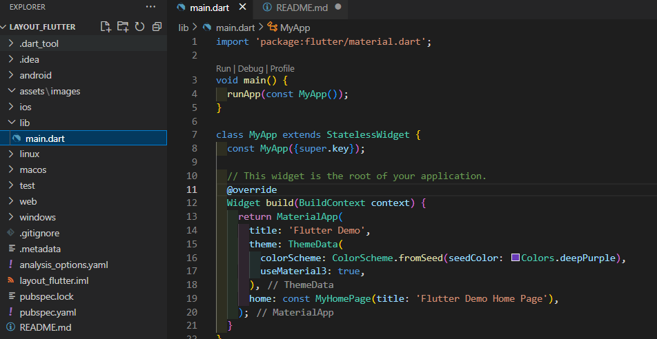
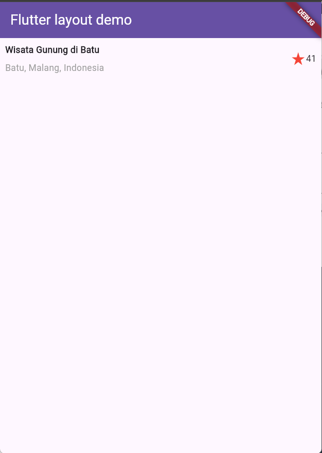
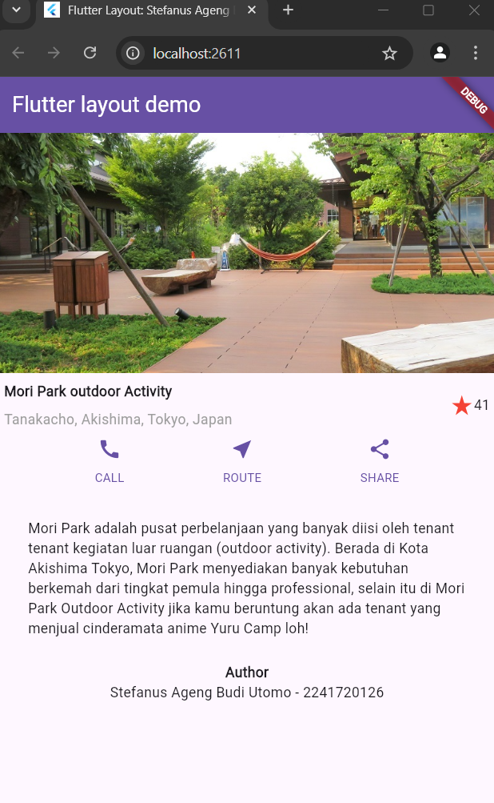

# Layout_flutter
<table>
<tr>
    <th>Nama</th>
    <td>Stefanus Ageng Budi Utomo</td>
</tr>
<tr>
    <th>NIM</th>
    <td>2241720126</td>
</tr>
<tr>
    <th>Kelas</th>
    <td>TI 3G</td>
</tr>
<tr>
    <th>Topik</th>
    <td>Layout dan Navigasi</td>
</tr>
</table>
<br>

# Report
## Praktikum 1: Membangun Layout di Flutter
### Langkah 1: Buat Project Baru 
Buatlah sebuah project flutter baru dengan nama layout_flutter. Atau sesuaikan style laporan praktikum yang Anda buat.


### Langkah 2: Buka file lib/main.dart
Buka file `main.dart` lalu ganti dengan kode berikut. Isi nama dan NIM Anda di `text title`.
``` dart
import 'package:flutter/material.dart';

void main() => runApp(const MyApp());

class MyApp extends StatelessWidget {
  const MyApp({super.key});

  @override
  Widget build(BuildContext context) {
    return MaterialApp(
      title: 'Flutter layout: Nama dan NIM Anda',
      home: Scaffold(
        appBar: AppBar(
          title: const Text('Flutter layout demo'),
        ),
        body: const Center(
          child: Text('Hello World'),
        ),
      ),
    );
  }
}
```

Implementasi:

``` dart
import 'package:flutter/material.dart';

void main() {
  runApp(const MyApp());
}

class MyApp extends StatelessWidget {
  const MyApp({super.key});

  @override
  Widget build(BuildContext context) {
    return MaterialApp(
      title: 'Flutter Layout: Stefanus Ageng Budi Utomo - 2241720126',
      theme: ThemeData(
        colorScheme: ColorScheme.fromSeed(seedColor: Colors.deepPurple),
        useMaterial3: true,
      ),
      home: Scaffold(
        appBar: AppBar(
          title: const Text('Flutter layout demo'),
        ),
        body: const Center(
          child: Text('Hello World'),
        ),
      ),
    );
  }
}
```

### Langkah 3: Identifikasi layout diagram
Langkah pertama adalah memecah tata letak menjadi elemen dasarnya:

Identifikasi baris dan kolom.
Apakah tata letaknya menyertakan kisi-kisi (grid)?
Apakah ada elemen yang tumpang tindih?
Apakah UI memerlukan tab?
Perhatikan area yang memerlukan alignment, padding, atau borders.
Pertama, identifikasi elemen yang lebih besar. Dalam contoh ini, empat elemen disusun menjadi sebuah kolom: sebuah gambar, dua baris, dan satu blok teks.

Setelah tata letak telah dibuat diagramnya, cara termudah adalah dengan menerapkan pendekatan bottom-up. Untuk meminimalkan kebingungan visual dari kode tata letak yang banyak bertumpuk, tempatkan beberapa implementasi dalam variabel dan fungsi.

### Langkah 4: Implementasi title row
Pertama, Anda akan membuat kolom bagian kiri pada judul. Tambahkan kode berikut di bagian atas metode `build()` di dalam kelas `MyApp`:
``` dart
Widget titleSection = Container(
  padding: const EdgeInsets.all(...),
  child: Row(
    children: [
      Expanded(
        /* soal 1*/
        child: Column(
          crossAxisAlignment: ...,
          children: [
            /* soal 2*/
            Container(
              padding: const EdgeInsets.only(bottom: ...),
              child: const Text(
                'Wisata Gunung di Batu',
                style: TextStyle(
                  fontWeight: FontWeight.bold,
                ),
              ),
            ),
            Text(
              'Batu, Malang, Indonesia',
              style: TextStyle(...),
            ),
          ],
        ),
      ),
      /* soal 3*/
      Icon(
       ...,
        color: ...,
      ),
      const Text(...),
    ],
  ),
);
```

Implementasi:

``` dart
import 'package:flutter/material.dart';

void main() {
  runApp(MyApp());
}

class MyApp extends StatelessWidget {
  MyApp({super.key});

  final Widget titleSection = Container(
    padding: const EdgeInsets.all(8),
    child: Row(
      children: [
        Expanded(
          /* soal 1*/
          child: Column(
            crossAxisAlignment: CrossAxisAlignment.start,
            children: [
              /* soal 2*/
              Container(
                padding: const EdgeInsets.only(bottom: 8),
                child: const Text(
                  'Wisata Gunung di Batu',
                  style: TextStyle(
                    fontWeight: FontWeight.bold,
                  ),
                ),
              ),
              const Text(
                'Batu, Malang, Indonesia',
                style: TextStyle(color: Colors.grey),
              ),
            ],
          ),
        ),
        /* soal 3*/
        const Icon(
          Icons.star_rate,
          color: Colors.red,
        ),
        const Text("41"),
      ],
    ),
  );

  @override
  Widget build(BuildContext context) {
    return MaterialApp(
      title: 'Flutter Layout: Stefanus Ageng Budi Utomo - 2241720126',
      theme: ThemeData(
        colorScheme: ColorScheme.fromSeed(seedColor: Colors.deepPurple),
        useMaterial3: true,
      ),
      home: Scaffold(
        appBar: AppBar(
          title: const Text(
            'Flutter layout demo',
            style: TextStyle(color: Colors.white),
          ),
          backgroundColor: Theme.of(context).primaryColor,
        ),
        body: Center(
          child: Column(
            children: [
              titleSection,
            ],
          ),
        ),
      ),
    );
  }
}
```


## Praktikum 2: Implementasi button row
### Langkah 1: Buat method Column _buildButtonColumn
Bagian tombol berisi 3 kolom yang menggunakan tata letak yang sama—sebuah ikon di atas baris teks. Kolom pada baris ini diberi jarak yang sama, dan teks serta ikon diberi warna primer.

Karena kode untuk membangun setiap kolom hampir sama, buatlah metode pembantu pribadi bernama buildButtonColumn(), yang mempunyai parameter warna, Icon dan Text, sehingga dapat mengembalikan kolom dengan widgetnya sesuai dengan warna tertentu.

`lib/main.dart (_buildButtonColumn)`
``` dart
class MyApp extends StatelessWidget {
  const MyApp({super.key});

  @override
  Widget build(BuildContext context) {
    // ···
  }

  Column _buildButtonColumn(Color color, IconData icon, String label) {
    return Column(
      mainAxisSize: MainAxisSize.min,
      mainAxisAlignment: MainAxisAlignment.center,
      children: [
        Icon(icon, color: color),
        Container(
          margin: const EdgeInsets.only(top: 8),
          child: Text(
            label,
            style: TextStyle(
              fontSize: 12,
              fontWeight: FontWeight.w400,
              color: color,
            ),
          ),
        ),
      ],
    );
  }
}
```

### Langkah 2: Buat widget buttonSection
Buat Fungsi untuk menambahkan ikon langsung ke kolom. Teks berada di dalam `Container` dengan margin hanya di bagian atas, yang memisahkan teks dari ikon.

Bangun baris yang berisi kolom-kolom ini dengan memanggil fungsi dan set warna, `Icon`, dan teks khusus melalui parameter ke kolom tersebut. Sejajarkan kolom di sepanjang sumbu utama menggunakan `MainAxisAlignment.spaceEvenly` untuk mengatur ruang kosong secara merata sebelum, di antara, dan setelah setiap kolom. Tambahkan kode berikut tepat di bawah deklarasi `titleSection` di dalam metode `build()`:

`lib/main.dart (buttonSection)`
``` dart
Color color = Theme.of(context).primaryColor;

Widget buttonSection = Row(
  mainAxisAlignment: MainAxisAlignment.spaceEvenly,
  children: [
    _buildButtonColumn(color, Icons.call, 'CALL'),
    _buildButtonColumn(color, Icons.near_me, 'ROUTE'),
    _buildButtonColumn(color, Icons.share, 'SHARE'),
  ],
);
```

### Langkah 3: Tambah button section ke body
Tambahkan variabel `buttonSection` ke dalam `body`:

``` dart
import 'package:flutter/material.dart';

void main() {
  runApp(MyApp());
}

class MyApp extends StatelessWidget {
  MyApp({super.key});

  // titleSection
  final Widget titleSection = Container(
    padding: const EdgeInsets.all(8),
    child: Row(
      children: [
        Expanded(
          /* soal 1*/
          child: Column(
            crossAxisAlignment: CrossAxisAlignment.start,
            children: [
              /* soal 2*/
              Container(
                padding: const EdgeInsets.only(bottom: 8),
                child: const Text(
                  'Wisata Gunung di Batu',
                  style: TextStyle(
                    fontWeight: FontWeight.bold,
                  ),
                ),
              ),
              const Text(
                'Batu, Malang, Indonesia',
                style: TextStyle(color: Colors.grey),
              ),
            ],
          ),
        ),
        /* soal 3*/
        const Icon(
          Icons.star_rate,
          color: Colors.red,
        ),
        const Text("41"),
      ],
    ),
  );

  Column _buildButtonColumn(Color color, IconData icon, String label) {
    return Column(
      mainAxisSize: MainAxisSize.min,
      mainAxisAlignment: MainAxisAlignment.center,
      children: [
        Icon(icon, color: color),
        Container(
          margin: const EdgeInsets.only(top: 8),
          child: Text(
            label,
            style: TextStyle(
              fontSize: 12,
              fontWeight: FontWeight.w400,
              color: color,
            ),
          ),
        )
      ],
    );
  }

  @override
  Widget build(BuildContext context) {
    Color color = Theme.of(context).primaryColor;
    // buttonSection
    Widget buttonSection = Row(
      mainAxisAlignment: MainAxisAlignment.spaceEvenly,
      children: [
        _buildButtonColumn(color, Icons.call, 'CALL'),
        _buildButtonColumn(color, Icons.near_me, 'ROUTE'),
        _buildButtonColumn(color, Icons.share, 'SHARE'),
      ],
    );
    return MaterialApp(
      title: 'Flutter Layout: Stefanus Ageng Budi Utomo - 2241720126',
      theme: ThemeData(
        colorScheme: ColorScheme.fromSeed(seedColor: Colors.deepPurple),
        useMaterial3: true,
      ),
      home: Scaffold(
        appBar: AppBar(
          title: const Text(
            'Flutter layout demo',
            style: TextStyle(color: Colors.white),
          ),
          backgroundColor: Theme.of(context).primaryColor,
        ),
        body: Center(
          child: Column(
            children: [
              titleSection,
              buttonSection,
            ],
          ),
        ),
      ),
    );
  }
}
```

## Praktikum 3: Implementasi text section
### Langkah 1: Buat widget textSection
Tentukan bagian teks sebagai variabel. Masukkan teks ke dalam Container dan tambahkan padding di sepanjang setiap tepinya. Tambahkan kode berikut tepat di bawah deklarasi buttonSection:

``` dart
Widget textSection = Container(
  padding: const EdgeInsets.all(32),
  child: const Text(
    'Carilah teks di internet yang sesuai '
    'dengan foto atau tempat wisata yang ingin '
    'Anda tampilkan. '
    'Tambahkan nama dan NIM Anda sebagai '
    'identitas hasil pekerjaan Anda. '
    'Selamat mengerjakan 🙂.',
    softWrap: true,
  ),
);
```
Dengan memberi nilai softWrap = true, baris teks akan memenuhi lebar kolom sebelum membungkusnya pada batas kata.

``` dart
final Widget textSection = Container(
    padding: const EdgeInsets.all(32),
    child: const Column(
        children: [
            Text(
            'Mori Park adalah pusat perbelanjaan yang banyak diisi oleh tenant tenant kegiatan luar ruangan (outdoor activity). Berada di Kota Akishima Tokyo, Mori Park menyediakan banyak kebutuhan berkemah dari tingkat pemula hingga professional, selain itu di Mori Park Outdoor Activity jika kamu beruntung akan ada tenant yang menjual cinderamata anime Yuru Camp loh!',
            softWrap: true,
            ),
            SizedBox(
            height: 24,
            ),
            Text(
            'Author',
            style: TextStyle(fontWeight: FontWeight.w700),
            ),
            Text('Stefanus Ageng Budi Utomo - 2241720126')
        ],
    )
);
```

### Langkah 2: Tambahkan variabel text section ke body
Tambahkan widget variabel textSection ke dalam body seperti berikut:
``` dart
home: Scaffold(
    appBar: AppBar(
    title: const Text(
        'Flutter layout demo',
        style: TextStyle(color: Colors.white),
    ),
    backgroundColor: Theme.of(context).primaryColor,
    ),
    body: Center(
    child: Column(
        children: [
        titleSection,
        buttonSection,
        textSection,
        ],
    ),
    ),
),
```

## Praktikum 4: Implementasi image section
### Langkah 1: Siapkan aset gambar
Anda dapat mencari gambar di internet yang ingin ditampilkan. Buatlah folder images di root project layout_flutter. Masukkan file gambar tersebut ke folder images, lalu set nama file tersebut ke file pubspec.yaml seperti berikut:
``` yaml
    flutter:
        uses-material-design: true
        assets:
            - images/lake.jpg
```
Contoh nama file gambar di atas adalah lake.jpg

``` yaml
    flutter:
    uses-material-design: true
    assets:
        - assets/images/Mori_Park.jpg
```

> [!TIP]
> - Perhatikan bahwa `pubspec.yaml` sensitif terhadap huruf besar-kecil, jadi tulis `assets:` dan URL gambar seperti yang ditunjukkan di atas.
> - File pubspec juga sensitif terhadap spasi, jadi gunakan indentasi yang tepat.
> - Anda mungkin perlu memulai ulang program yang sedang berjalan (baik di simulator atau perangkat yang terhubung) agar perubahan `pubspec` dapat diterapkan.

### Langkah 2: Tambahkan gambar ke body
Tambahkan aset gambar ke dalam body seperti berikut:
``` dart
body: Center(
    child: Column(
    children: [
        Image.asset(
        'assets/images/Mori_Park.jpg',
        width: double.infinity,
        height: 240,
        fit: BoxFit.cover,
        ),
        titleSection,
        buttonSection,
        textSection,
    ],
    ),
),
```

`BoxFit.cover` memberi tahu kerangka kerja bahwa gambar harus sekecil mungkin tetapi menutupi seluruh kotak rendernya.

### Langkah 3: Terakhir, ubah menjadi ListView
Pada langkah terakhir ini, atur semua elemen dalam ListView, bukan Column, karena ListView mendukung scroll yang dinamis saat aplikasi dijalankan pada perangkat yang resolusinya lebih kecil.

``` dart
body: Center(
    child: ListView(
    children: [
        Image.asset(
        'assets/images/Mori_Park.jpg',
        width: double.infinity,
        height: 240,
        fit: BoxFit.cover,
        ),
        titleSection,
        buttonSection,
        textSection,
    ],
    ),
),
```
Hasil:



## Tugas Praktikum 1
1. Selesaikan Praktikum 1 sampai 4, lalu dokumentasikan dan push ke repository Anda berupa screenshot setiap hasil pekerjaan beserta penjelasannya di file `README.md`!
2. Silakan implementasikan di project baru "basic_layout_flutter" dengan mengakses sumber ini: https://docs.flutter.dev/codelabs/layout-basics
3. Kumpulkan link commit repository GitHub Anda kepada dosen yang telah disepakati!

Selesai