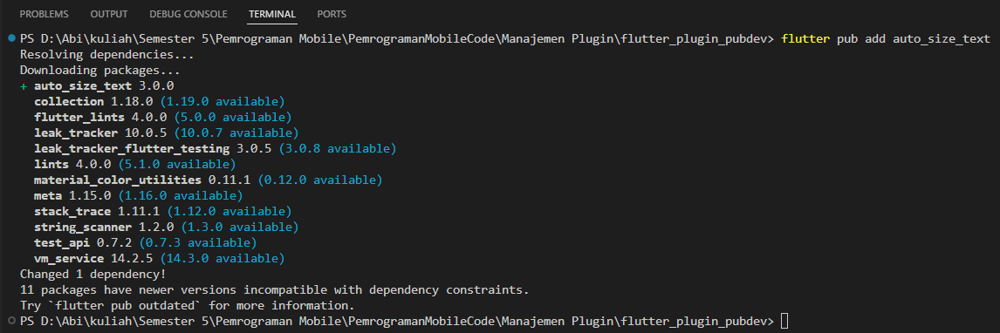

# Laporan Praktikum
<table>
<tr>
    <th>Nama</th>
    <td>Stefanus Ageng Budi Utomo</td>
</tr>
<tr>
    <th>NIM</th>
    <td>2241720126</td>
</tr>
<tr>
    <th>Kelas</th>
    <td>TI 3G</td>
</tr>
<tr>
    <th>Topik</th>
    <td>Manajemen Plugin</td>
</tr>
</table>
<br>

# Tugas Praktikum 
1. Selesaikan Praktikum tersebut, lalu dokumentasikan dan push ke repository Anda berupa screenshot hasil pekerjaan beserta penjelasannya di file README.md!
2. Jelaskan maksud dari langkah 2 pada praktikum tersebut!
3. Jelaskan maksud dari langkah 5 pada praktikum tersebut!
4. Pada langkah 6 terdapat dua widget yang ditambahkan, jelaskan fungsi dan perbedaannya!
5. Jelaskan maksud dari tiap parameter yang ada di dalam plugin auto_size_text berdasarkan tautan pada dokumentasi ini !

## 1. Selesaikan Praktikum tersebut, lalu dokumentasikan dan push ke repository Anda berupa screenshot hasil pekerjaan beserta penjelasannya di file README.md!
### Langkah 1: Buat Project Baru
Buatlah sebuah project flutter baru dengan nama flutter_plugin_pubdev. Lalu jadikan repository di GitHub Anda dengan nama flutter_plugin_pubdev.


### Langkah 2: Menambahkan Plugin
Tambahkan plugin auto_size_text menggunakan perintah berikut di terminal
``` terminal
flutter pub add auto_size_text
```
Jika berhasil, maka akan tampil nama plugin beserta versinya di file pubspec.yaml pada bagian dependencies.




### Langkah 3: Buat file red_text_widget.dart
Buat file baru bernama red_text_widget.dart di dalam folder lib lalu isi kode seperti berikut.
``` dart
import 'package:flutter/material.dart';

class RedTextWidget extends StatelessWidget {
  const RedTextWidget({Key? key}) : super(key: key);

  @override
  Widget build(BuildContext context) {
    return Container();
  }
}
```


### Langkah 4: Tambah Widget AutoSizeText
Masih di file red_text_widget.dart, untuk menggunakan plugin auto_size_text, ubahlah kode return Container() menjadi seperti berikut.
``` dart
return AutoSizeText(
      text,
      style: const TextStyle(color: Colors.red, fontSize: 14),
      maxLines: 2,
      overflow: TextOverflow.ellipsis,
);
```
Setelah Anda menambahkan kode di atas, Anda akan mendapatkan info error. Mengapa demikian? Jelaskan dalam laporan praktikum Anda!


Error tersebut terjadi karena variable `text` tidak terdeklarasi sebelumnya.

### Langkah 5: Buat Variabel text dan parameter di constructor
Tambahkan variabel text dan parameter di constructor seperti berikut.
``` dart
final String text;

const RedTextWidget({Key? key, required this.text}) : super(key: key);
```


### Langkah 6: Tambahkan widget di main.dart
Buka file `main.dart` lalu tambahkan di dalam children: pada class _MyHomePageState
``` dart
Container(
   color: Colors.yellowAccent,
   width: 50,
   child: const RedTextWidget(
             text: 'You have pushed the button this many times:',
          ),
),
Container(
    color: Colors.greenAccent,
    width: 100,
    child: const Text(
           'You have pushed the button this many times:',
          ),
),
```
Run aplikasi tersebut dengan tekan F5, maka hasilnya akan seperti berikut.


## 2. Jelaskan maksud dari langkah 2 pada praktikum tersebut!
> Tambahkan plugin auto_size_text menggunakan perintah berikut di terminal
> ``` terminal
> flutter pub add auto_size_text
> ```
> Jika berhasil, maka akan tampil nama plugin beserta versinya di file pubspec.yaml pada bagian dependencies.

Perintah tersebut adalah untuk menambahkan plugin `auto_size_text` pada project dan menambahkannya pada file `pubsec.yaml`. dan untuk jaga jaga bisa menjalankan perintah `flutter pub get` untuk mengunduh plugin tersebut keproject untuk siap digunakan.

## 3. Jelaskan maksud dari langkah 5 pada praktikum tersebut!
> ### Langkah 3: Buat file red_text_widget.dart
> Buat file baru bernama red_text_widget.dart di dalam folder lib lalu isi kode seperti berikut.
> ``` dart
> import 'package:flutter/material.dart';
>
> class RedTextWidget extends StatelessWidget {
>  const RedTextWidget({Key? key}) : super(key: key);
>
>  @override
>  Widget build(BuildContext context) {
>    return Container();
>  }
> }
> ```

Langkah tersebut dilakukan untuk mendeklarasikan variabel `text` untuk menampung sebuah argumen yang diterima constructor untuk bisa digunakan nantinya sesuai custom yang kita inginkan.

## 4. Pada langkah 6 terdapat dua widget yang ditambahkan, jelaskan fungsi dan perbedaannya!
``` dart
Container(
   color: Colors.yellowAccent,
   width: 50,
   child: const RedTextWidget(
             text: 'You have pushed the button this many times:',
          ),
),
Container(
    color: Colors.greenAccent,
    width: 100,
    child: const Text(
           'You have pushed the button this many times:',
          ),
),
```

2 widget tersebut digunakan untuk menampilkan kotak dengan warna yang berbeda untuk menampung widget `red_text_widget` dan `text`. dimana `red_text_widget` textnya akan menyesuaikan ukuran widget dan akan terpotong jika tidak memungkinkan sedangkan `text` tidak.

## 5. Jelaskan maksud dari tiap parameter yang ada di dalam plugin auto_size_text berdasarkan tautan pada dokumentasi [ini](https://pub.dev/documentation/auto_size_text/latest/) !
| Parameter          | Deskripsi                                                                                                  |
|--------------------|-----------------------------------------------------------------------------------------------------------|
| key*               | Mengontrol bagaimana satu widget menggantikan widget lain dalam pohon widget.                              |
| textKey            | Mengatur kunci untuk widget Text yang dihasilkan.                                                          |
| style*             | Jika tidak null, gaya yang digunakan untuk teks ini.                                                       |
| minFontSize        | Batas ukuran teks minimum yang digunakan saat mengatur ukuran teks otomatis. Diabaikan jika presetFontSizes diatur. |
| maxFontSize        | Batas ukuran teks maksimum yang digunakan saat mengatur ukuran teks otomatis. Diabaikan jika presetFontSizes diatur. |
| stepGranularity    | Langkah ukuran dalam mana ukuran font disesuaikan dengan batasan.                                          |
| presetFontSizes    | Mendefinisikan semua ukuran font yang mungkin. Catatan: presetFontSizes harus diurutkan dari besar ke kecil. |
| group              | Menyinkronkan ukuran beberapa AutoSizeText.                                                                |
| textAlign*         | Bagaimana teks seharusnya diratakan secara horizontal.                                                     |
| textDirection*     | Arah teks. Ini menentukan bagaimana nilai textAlign seperti TextAlign.start dan TextAlign.end ditafsirkan.  |
| locale*            | Digunakan untuk memilih font ketika karakter Unicode yang sama bisa dirender berbeda, tergantung pada lokal. |
| softWrap*          | Apakah teks harus terpotong pada pemotongan baris lunak.                                                   |
| wrapWords          | Apakah kata-kata yang tidak muat di satu baris harus dibungkus. Default-nya adalah true seperti Text.      |
| overflow*          | Bagaimana overflow visual harus ditangani.                                                                 |
| overflowReplacement| Jika teks meluap dan tidak muat pada batasannya, widget ini akan ditampilkan sebagai gantinya.             |
| textScaleFactor*   | Jumlah piksel font untuk setiap piksel logis. Juga memengaruhi minFontSize, maxFontSize, dan presetFontSizes.|
| maxLines           | Jumlah maksimum baris opsional untuk rentang teks.                                                         |
| semanticsLabel*    | Label semantik alternatif untuk teks ini.                                                                  |

Keterangan: Parameter yang ditandai dengan * berfungsi sama seperti dalam widget Text.
