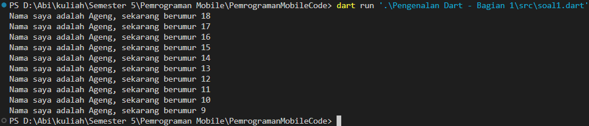

# Laporan Praktikum
<table>
<tr>
    <th>Nama</th>
    <td>Stefanus Ageng Budi Utomo</td>
</tr>
<tr>
    <th>NIM</th>
    <td>2241720126</td>
</tr>
<tr>
    <th>Kelas</th>
    <td>TI 3G</td>
</tr>
<tr>
    <th>Topik</th>
    <td>Pengantar Bahasa Pemrograman Dart - Bagian 1</td>
</tr>
</table>
<br>

# Soal
## 1. Memodifikasi kode menjadi output seperti yang diminta

### Code
```dart
void main(){
    for(var i = 18; i > 8; i--){
        print('Nama saya adalah Ageng, sekarang berumur $i');
    }
}
```
<!--  -->

### Output


## 2. Mengapa sangat penting untuk memahami bahasa pemrograman Dart sebelum kita menggunakan framework Flutter ? Jelaskan!
Karena flutter adalah framework yang dibangun dengan bahasa dart, jadi penting untuk bisa memahami bahasa dart agar mudah untuk menggunakannya dan memakainya dengan nyaman.

## 3. Rangkumlah materi dari codelab ini menjadi poin-poin penting yang dapat Anda gunakan untuk membantu proses pengembangan aplikasi mobile menggunakan framework Flutter.
1. Bahasa Dart Adalah Inti dari Framework Flutter
    - Framework flutter dibangun dengan bahasa Dart.
    - Memiliki pemahaman dasar yang kuat tentang Dart akan memudahkan kita untuk menjadi lebih produktif dengan flutter.
2. Fitur Utama Dart
    - Dart dibuat bertujuan untuk menggabungkan kelebihan-kelebihan dari sebagai besar bahasa tingkat tinggi dengan fiturnya seperti: productive tools, garbage collection, type annotations, statically type dan juga portabilitynya.
3. Perkembangan Dart
    - Dart diluncurkan pada 2011 dengan versi stabilnya pada 2013
    - Awalnya berfokus pada pengembangan web dengan tujuan memecahkan masalah pada JavaScript dan menggantikan JavaScript namun sekarang telah berubah fokus menjadi pada mobile development.
4. Cara Kompilasi Dart
    - Dalam dart ada 2 mode kompilasi yaitu (Just-In-Time)JIT dan (Ahead-Of-Time)AOT
        - Kompilasi JIT memungkinkan untuk bisa debugging dan hot reload pada saat pengembangan.
        - Kompilasi AOT berjalan dengan menkompile kode sebelumnya untuk meningkatkan peforma namun fitur pada JIT seperti debugging dan hot reload akan menghilang.
5. Struktur Bahasa Dart
    - Dart dirancang untuk object-oriented(OO) dengan memiliki fitur seperti encapsulation, inheritance, composition, abstraction, dan polymorphism.
    - Dart memiliki operator yang sama seperti bahasa lainnya untuk mendifinisikan sintak khusus seperti operator aritmatika, increment, decrement, quality, relational and logika.
6. Cara Menjalankan Kode Program Dart
    - Function `main()` adalah titik awal mulainya setiap program dart
    - Perbedaan function dengan method
        - Function berada di luar class dan berdiri sendiri, seperti function main.
        - Sedangkan method adalah function yang terkait dengan object atau class.
