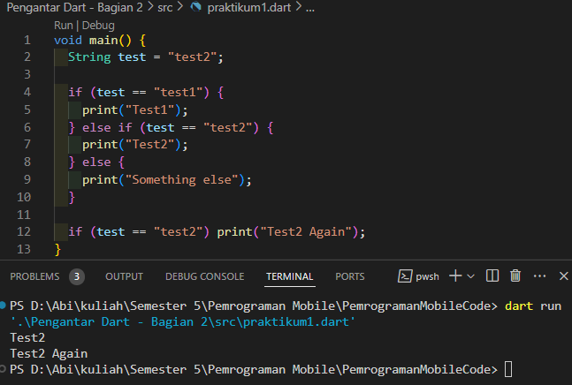
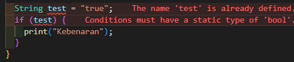
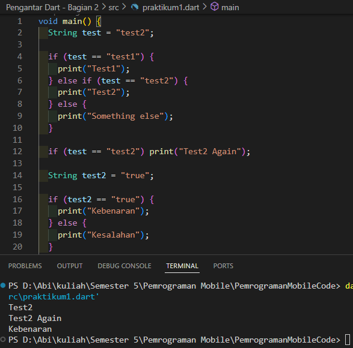
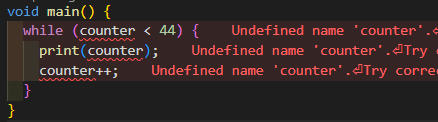
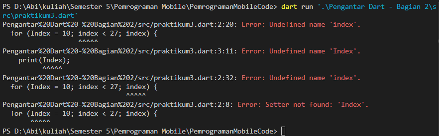
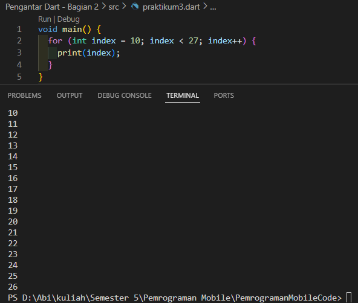
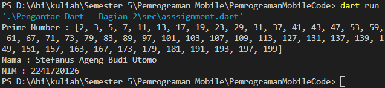

# Laporan Praktikum
<table>
<tr>
    <th>Nama</th>
    <td>Stefanus Ageng Budi Utomo</td>
</tr>
<tr>
    <th>NIM</th>
    <td>2241720126</td>
</tr>
<tr>
    <th>Kelas</th>
    <td>TI 3G</td>
</tr>
<tr>
    <th>Topik</th>
    <td>Pengantar Bahasa Pemrograman Dart - Bagian 2</td>
</tr>
</table>
<br>

# Praktikum 1: Menerapkan Control Flows ("if/else")
## Langkah 1
<!-- Ketik atau salin kode berikut ke dalam fungsi 'main()'. -->
``` dart
void main() {
  String test = "test2";

  if (test == "test1") {
    print("Test1");
  } else if (test == "test2") {
    print("Test2");
  } else {
    print("Something else");
  }

  if (test == "test2") print("Test2 Again");
}
```

## Langkah 2

1. Pada baris pertama, deklarasi fungsi 'main()' dimana fungsi tersebut untuk titik awal program untuk dieksekusi.
2. Pada baris kedua, deklarasi sebuah variabel bernama test dengan nilai "test2".
3. Pada baris block if pertama, digunakan untuk memeriksa nilai dari variabel test dengan berbagai kondisi sebagai berikut:
    - Jika test = sama dengan "test1", maka program akan mencetak "Test1".
    - Jika test = sama dengan "test2", maka program akan mencetak "Test2".
    - Jika test tidak sama dengan kondisi yang ada seperti "test1" atau "test2" maka fungsi default yang berada di 'else' akan dijalankan dan akan mencetak "Something else".
4. Pada baris block if kedua, mengecek apakah test sama dengan "test2". Jika iya, maka program akan mencetak "Test2 again".

## Langkah 3
Kode awal
``` dart
String test = "true";
if (test) {
   print("Kebenaran");
}
```
Hasil errornya: <br>
 <br>
Perbaikan
``` dart
  String test2 = "true";

  if (test2 == "true") {
    print("Kebenaran");
  } else {
    print("Kesalahan");
  }
```
atau bisa menggunakan boolean
``` dart
  bool test2 = true;

  if(test2) {
    print("Kebenaran");
  } else {
    print("Kesalahan");
  }
```
output: <br>



# Praktikum 2: Menerapkan Perulangan "while" dan "do-while"
## Langkah 1
``` dart
void main() {
  while (counter < 44) {
    print(counter);
    counter++;
  }
}
```

## Langkah 2
 <br>
Error Tersebut disebabkan karena tidak adanya deklarasi variabel 'counter' sebelumnya.

Perbaikan
``` dart
void main() {
  int counter = 0;

  while (counter < 44) {
    print(counter);
    counter++;
  }
}

```

## Langkah 3
Menambahkan kode
``` dart
while (counter < 33) {
  print(counter);
  counter++;
}
```

menjadi
``` dart
void main() {
  int counter = 0;

  while (counter < 44) {
    print(counter);
    counter++;
  }

  do {
    print(counter);
    counter++;
  } while (counter < 77);
}
```

# Praktikum 3: Menerapkan Perulangan "for" dan "break-continue"
## Langkah 1
``` dart
void main() {
  for (Index = 10; index < 27; index) {
    print(Index);
  }
}
```

## Langkah 2

Error tersebut terjadi karena variabel 'index' belum di deklarasikan sebelumnya dan tidak adanya proses increment/decrement pada argumen yang dapat mengakibatkan infinity loop nantinya. <br>
Cara untuk memperbaiknya adalah dengan mendeklarasikannya sebelum digunakan dan menambahkan increment agar tidak terjadi infinity loop. <br>
Sebagai berikut perbaikan kodenya:
``` dart
void main() {
  for (int index = 10; index < 27; index++) {
    print(index);
  }
}
```
Hasil: <br>


## Langkah 3
Menambahkan kode menjadi:
``` dart
void main() {
  for (int index = 10; index < 27; index++) {
    print(index);
  }

  If (Index == 21) break;
  Else If (index > 1 || index < 7) continue;
  print(index);
}
```


Perbaikan:
``` dart
void main() {
  for (int index = 10; index < 27; index++) {
    if (index == 21) {
      break;
    } else if (index > 1 && index < 7) {
      continue;
    }
    print(index);
  }
}
```

terdapat hal yang diganti ketika diperbaiki selain penulisan if-else tetapi pada operasi perbandingan yaitu pada 'index > 1 && index < 7' yang sebelumnya menggunakan perbandingan '||' menjadi '&&'. Pergantian operator perbandingan tersebut dikarenakan operator '||' atau 'OR' jika nilai salah satunya benar maka akan dianggap benar, sedangkan '&&' adalah 'AND' yang dimana diperlukan benar dikedua ekspresinya.

pada langkah 3 diminta untuk menampilkan angka 10 sampai dengan kurang dari 21, jika menggunakan '||' atau 'OR' ketika salah satu nilainya benar maka perulangan akan di lewati dan tidak akan sesuatu di cetak karena 'index > 1' akan bernilai 'true' karena variabel index mulai dari 10.

# Tugas Praktikum
Buatlah sebuah program yang dapat menampilkan bilangan prima dari angka 0 sampai 201 menggunakan Dart. Ketika bilangan prima ditemukan, maka tampilkan nama lengkap dan NIM Anda.

Code:
``` dart
bool isPrime(int number) {
  if (number < 2) {
    return false;
  }
  for (var i = 2; i <= number ~/ 2; i++) { // ~/ digunakan untuk membagi dua angka dan secara otomatis mengonversi hasilnya menjadi bilangan bulat (int) dengan membuang bagian desimal atau pecahannya.
    if (number % i == 0) {
      return false;
    }
  }
  return true;
}

void main() {
  List<int> primeNumber = [];

  for (var i = 2; i <= 201; i++) {
    if (isPrime(i)) {
      primeNumber.add(i);
    }
  }

  if (primeNumber.isNotEmpty) {
    print("Prime Number : $primeNumber");
    print("Nama : Stefanus Ageng Budi Utomo\nNIM : 2241720126");
  }
}
```
Output: <br>
