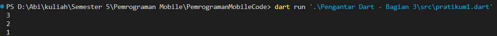

# Laporan Praktikum
<table>
<tr>
    <th>Nama</th>
    <td>Stefanus Ageng Budi Utomo</td>
</tr>
<tr>
    <th>NIM</th>
    <td>2241720126</td>
</tr>
<tr>
    <th>Kelas</th>
    <td>TI 3G</td>
</tr>
<tr>
    <th>Topik</th>
    <td>Pengantar Bahasa Pemrograman Dart - Bagian 3</td>
</tr>
</table>
<br>

## Praktikum 1: Eksperimen Tipe Data List
### Langkah 1
``` dart
void main() {
  var list = [1, 2, 3];
  assert(list.length == 3);
  assert(list[1] == 2);
  print(list.length);
  print(list[1]);

  list[1] = 1;
  assert(list[1] == 1);
  print(list[1]);
}
```

### Langkah 2
Hasil eksekusi kode: <br>
 <br>
Fungsi `assert()` di Dart adalah untuk melakukan validasi kondisi selama debugging. Jika kondisi yang diberikan ke dalam fungsi `assert()` bernilai true, eksekusi program akan berlanjut seperti biasa. Namun, jika kondisinya false, `assert()` akan memicu error, menghentikan eksekusi program, dan menampilkan pesan kesalahan. <br><br>

jadi pada baris
``` dart
assert(list.length == 3);
assert(list[1] == 2);
assert(list[1] == 1);
```
Mengecek apakah argumen yang diberikan bernilai benar untuk melanjutkan program, jika pada salah satu barus tersebut terjadi nilai false pada `assert()` maka program akan memicu error dan berhenti.

### Langkah 3
Ubah kode pada langkah 1 menjadi variabel final yang mempunyai index = 5 dengan default value = null. Isilah nama dan NIM Anda pada elemen index ke-1 dan ke-2. Lalu print dan capture hasilnya.
Kode:
``` dart
void main() {
    final List<String?> list = List.filled(5, null);

    list[1] = "Stefanus Ageng Budi Utomo";
    list[2] = "2241720126";
    print(list);
}
```
Hasil: <br>
 <br>
Jika tipe data `var` diganti menjadi `final` maka akan terjadi error, karena `final` tidak bisa menentukan sendiri untuk tipe data yang diinisialisasi pada variabel tersebut, maka dari itu perlu diberi deklarasi tipe datanya secara manual.

Untuk membuat List dengan panjang 5 dengan nilai null bisa menggunakan dengan bantuan `filled` dari `List`. Dimana method `List.filled()` digunakan untuk membuat list dengan ukuran tertentu sebagai argumen pertama, dan nilai defaultnya pada argument kedua.

## Pratikum 2: Eksperimen Tipe Data Set
### Langkah 1
``` dart
void main() {
  var halogens = {'fluorine', 'chlorine', 'bromine', 'iodine', 'astatine'};
print(halogens);
}
```

### Langkah 2
 <br>

Hasilnya menampilkan semua nilai yang terdapat pada set halogens.

### Langkah 3
Kode: <br>
``` dart
void main() {
    var halogens = {'fluorine', 'chlorine', 'bromine', 'iodine', 'astatine'};
    print(halogens);

    var names1 = <String>{};
    Set<String> names2 = {}; // This works, too.
    var names3 = {}; // Creates a map, not a set.

    print(names1);
    print(names2);
    print(names3);
}
```
Hasil:
 <br>

[!ubah]

Yang terjadi adalah membuat 3 variabel dengan 2 tipe `Set`(names1, names2) dan 1 tipe `Map`(names3). 

> [!NOTE]
> Tambahkan elemen nama dan NIM Anda pada kedua variabel Set tersebut dengan dua fungsi berbeda yaitu .add() dan .addAll(). Untuk variabel Map dihapus.

<br>
Kode:

``` dart
void main() {
    var halogens = {'fluorine', 'chlorine', 'bromine', 'iodine', 'astatine'};
    print(halogens);

    var names1 = <String>{};
    Set<String> names2 = {};

    names1.add('Stefanus Ageng Budi Utomo');
    names1.add('2241720126');
    names2.addAll(names1);

    print(names1);
    print(names2);
}
```

Hasil:<br>
 <br>

`add()` digunakan untuk menambahkan nilai di belakang list, Sedangkan `addAll()` digunakan untuk menambahkan semua elemen dari satu list ke list lainnya.

## Pratikum 3: Eksperimen Tipe Data Maps
### Langkah 1
``` dart
void main() {
    var gifts = {
    // Key:    Value
    'first': 'partridge',
    'second': 'turtledoves',
    'fifth': 1
    };

    var nobleGases = {
    2: 'helium',
    10: 'neon',
    18: 2,
    };

    print(gifts);
    print(nobleGases);
}
```

### Langkah 2
Hasilnya output: <br>
 <br>

### Langkah 3
Tambahkan kode berikut
``` dart
var mhs1 = Map<String, String>();
gifts['first'] = 'partridge';
gifts['second'] = 'turtledoves';
gifts['fifth'] = 'golden rings';

var mhs2 = Map<int, String>();
nobleGases[2] = 'helium';
nobleGases[10] = 'neon';
nobleGases[18] = 'argon';
```

Hasil:

Tidak terjadi error hanya saja tampil `Map` kosong.

> [!NOTE]
> Tambahkan elemen nama dan NIM Anda pada tiap variabel di atas (gifts, nobleGases, mhs1, dan mhs2). Dokumentasikan hasilnya dan buat laporannya!

Perbaikan
``` dart
void main() {
    var gifts = {
    // Key:    Value
    'first': 'partridge',
    'second': 'turtledoves',
    'fifth': 1,
    'NIM': '2241720126',
    'Nama': 'Stefanus Ageng Budi Utomo',
    };

    var nobleGases = {
    2: 'helium',
    10: 'neon',
    18: 2,
    'NIM': '2241720126',
    'Nama': 'Stefanus Ageng Budi Utomo',
    };

    gifts['first'] = 'partridge';
    gifts['second'] = 'turtledoves';
    gifts['fifth'] = 'golden rings';
    gifts['NIM'] = '2241720126';
    gifts['Nama'] = 'Stefanus Ageng Budi Utomo';

    nobleGases[2] = 'helium';
    nobleGases[10] = 'neon';
    nobleGases[18] = 'argon';
    nobleGases['NIM'] = '2241720126';
    nobleGases['Nama'] = 'Stefanus Ageng Budi Utomo';

    var mhs1 = Map<String, String>();
    var mhs2 = Map<int, String>();

    mhs1['NIM'] = '2241720126';
    mhs1['Nama'] = 'Stefanus Ageng Budi Utomo';

    mhs2[100] = '2241720126';
    mhs2[101] = 'Stefanus Ageng Budi Utomo';

    print(gifts);
    print(nobleGases);
    print(mhs1);
    print(mhs2);
}
```

## Praktikum 4: Eksperimen Tipe Data List: Spread dan Control-flow Operators

### Langkah 1
``` dart
void main() {
    var list = [1, 2, 3];
    var list2 = [0, ...list];
    print(list1);
    print(list2);
    print(list2.length);~
}
```

### Langkah 2
Hasil output:
 <br>

Perbaikan:
``` dart
void main() {
  var list = [1, 2, 3];
  var list2 = [0, ...list];
  print(list);
  print(list2);
  print(list2.length);
}
```

Hasil perbaikan:
 <br>

### Langkah 3
Tambahkan kode berikut
``` dart
list1 = [1, 2, null];
print(list1);
var list3 = [0, ...?list1];
print(list3.length);
```

Hasilnya:
 <br>

**Perbaiki jika terjadi error!** <br>
Perbaikan
``` dart
void main() {
    var list = [1, 2, 3];
    List<int?> list1 = [1, 2, null];
    var list2 = [0, ...list];
    var list3 = [0, ...list1];

    print(list);
    print(list1);
    print(list2);
    print(list2.length);
    print(list3.length);
}
```

Hasil perbaikan:
 <br>

> [!NOTE]
> Tambahkan variabel list berisi NIM Anda menggunakan Spread Operators. Dokumentasikan hasilnya dan buat laporannya!

kode:
``` dart
void main() {
    var list = [1, 2, 3];
    List<int?> list1 = [1, 2, null];
    var list2 = [0, ...list];
    var list3 = [0, ...list1];
    var nim1 = [2, 2, 4, 1, 7];
    var nim2 = [2, 0, 1, 2, 6];
    var nim = [...nim1, ...nim2];

    print(list);
    print(list1);
    print(list2);
    print(list2.length);
    print(list3.length);
    print(nim);
}
```

Hasilnya:
 <br>

### Langkah 4
Tambahkan kode berikut lalu coba run:
``` dart
var nav = ['Home', 'Furniture', 'Plants', if (promoActive) 'Outlet'];
print(nav);
```
Hasil:
 <br>

Perbaikan:
``` dart
var promoActive = true;
var nav = ['Home', 'Furniture', 'Plants', if (promoActive) 'Outlet'];
print(nav);
```
Output: <br>
`promoActive = true`
``` terminal
[Home, Furniture, Plants, Outlet]
```

`promoActive = false`
``` terminal
[Home, Furniture, Plants]
```

### Langkah 5
Tambahkan kode berikut:
``` dart
var nav2 = ['Home', 'Furniture', 'Plants', if (login case 'Manager') 'Inventory'];
print(nav2);
```
ouput:
``` terminal
Error: Undefined name 'login'.
if (login case 'Manager') 'Inventory'
    ^^^^^
```

Perbaikan:
``` dart
void main() {
    var login = 'Manager';
    var nav2 = [
    'Home',
    'Furniture',
    'Plants',
    if (login case 'Manager') 'Inventory'
    ];
    print(nav2);
}
```

Output: <br>
`login = 'Manager'`
``` terminal
[Home, Furniture, Plants, Inventory]
```

`login = 'Admin'`
``` terminal
[Home, Furniture, Plants]
```

### Langkah 6
Tambahkan kode berikut:
``` dart
var listOfInts = [1, 2, 3];
var listOfStrings = ['#0', for (var i in listOfInts) '#$i'];
assert(listOfStrings[1] == '#1');
print(listOfStrings);
```
Apa yang terjadi ? Jika terjadi error, silakan perbaiki. Jelaskan manfaat Collection For dan dokumentasikan hasilnya. <br>
Output:
``` terminal
[#0, #1, #2, #3]
```

`Collection For` dalam Dart memungkinkan kita untuk menggunakan loop dalam konteks collection seperti list dengan menghindari langkah tambahan, seperti membuat list kosong lalu menambahkannya satu per satu.

## Praktikum 5: Eksperimen Tipe Data Records
### Langkah 1
Ketik atau salin kode program berikut ke dalam fungsi main().
``` dart
void main() {
    var record = ('first', a: 2, b: true, 'last');
    print(record);
}
```

### Langkah 2
Silakan coba eksekusi (Run) kode pada langkah 1 tersebut. Apa yang terjadi? Jelaskan! Lalu perbaiki jika terjadi error.
output: <br>
``` terminal
(first, last, a: 2, b: true)
```

### Langkah 3
Tambahkan kode program berikut di luar scope void main(), lalu coba eksekusi (Run) kode Anda.
``` dart
(int, int) tukar((int, int) record) {
  var (a, b) = record;
  return (b, a);
}
```
Apa yang terjadi ? Jika terjadi error, silakan perbaiki. Gunakan fungsi tukar() di dalam main() sehingga tampak jelas proses pertukaran value field di dalam Records. <br> <br>
Kode lengkap dengan perbaikan:
``` dart
void main() {
    var record = (1, 2);
    print("Sebelum ditukar: ");
    print(record);
    print("Setelah ditukar: ");
    print(tukar(record));
}

(int, int) tukar((int, int) record) {
    var (a, b) = record;
    return (b, a);
}
```

Output:
``` terminal
Sebelum ditukar: 
(1, 2)
Setelah ditukar:
(2, 1)
```

### Langkah 4
Tambahkan kode program berikut di dalam scope void main(), lalu coba eksekusi (Run) kode Anda.
``` dart
// Record type annotation in a variable declaration:
(String, int) mahasiswa;
print(mahasiswa);
```
Apa yang terjadi ? Jika terjadi error, silakan perbaiki. Inisialisasi field nama dan NIM Anda pada variabel record mahasiswa di atas. Dokumentasikan hasilnya dan buat laporannya! <br>
``` terminal
Error: Non-nullable variable 'mahasiswa' must be assigned before it can be used.
print(mahasiswa);
      ^^^^^^^^^
```
Perbaikan:
``` dart
void main() {
  (String, int) mahasiswa = ('Stefanus Ageng Budi Utomo', 2241720126);
  print(mahasiswa);
}
```
Output:
``` terminal
(Stefanus Ageng Budi Utomo, 2241720126)
```

### Langkah 5
Tambahkan kode program berikut di dalam scope void main(), lalu coba eksekusi (Run) kode Anda.
``` dart
var mahasiswa2 = ('first', a: 2, b: true, 'last');

print(mahasiswa2.$1); // Prints 'first'
print(mahasiswa2.a); // Prints 2
print(mahasiswa2.b); // Prints true
print(mahasiswa2.$2); // Prints 'last'
```
Apa yang terjadi ? Jika terjadi error, silakan perbaiki. Gantilah salah satu isi record dengan nama dan NIM Anda, lalu dokumentasikan hasilnya dan buat laporannya!

Perbaikan:
``` dart
void main() {
    // langkah 5
    var mahasiswa2 =
        ('Stefanus Ageng Budi Utomo', a: 2241720126, b: true, 'last');

    print(mahasiswa2.$1);
    print(mahasiswa2.a);
    print(mahasiswa2.b);
    print(mahasiswa2.$2);
}
```
Output:
``` terminal
Stefanus Ageng Budi Utomo
2241720126
true
last
```

# Tugas Praktikum
1. Silakan selesaikan Praktikum 1 sampai 5, lalu dokumentasikan berupa screenshot hasil pekerjaan Anda beserta penjelasannya!
- Sudah di atas laporan ini
2. Jelaskan yang dimaksud Functions dalam bahasa Dart!
- `Functions` dalam Dart adalah block kode yang dapat dieksekusi ketika dipanggil. `Functions` dapat kita gunakan untuk mengelompokkan serangkaian instruksi yang berhubungan dan menjalankannya berulang kali tanpa harus menulis ulang kode.
3. Jelaskan jenis-jenis parameter di Functions beserta contoh sintaksnya!
- Positional Parameters
    
    Parameter yang wajib diisi dan diurutkan sesuai posisinya saat fungsi dipanggil. Parameter ini dideklarasikan secara berurutan di dalam tanda kurung `()`.
    ``` dart
    void greet(String name, int age) {
        print('Hello $name, you are $age years old.');
    }

    void main() {
        greet('Ageng', 23); // Output: Hello Alice, you are 23 years old.
    }
    ```
- Optional Positional Parameters

    Parameter yang bisa diisi atau tidak. Parameter ini dibungkus dalam tanda kurung siku `[]` dan dapat memiliki nilai default jika tidak disediakan.
    ``` dart
    void greet(String name, [int? age]) {
    if (age != null) {
        print('Hello $name, you are $age years old.');
    } else {
        print('Hello $name!');
    }
    }

    void main() {
        greet('Ageng'); // Output: Hello Ageng!
        greet('Budi', 30); // Output: Hello Budi, you are 30 years old.
    }
    ```
- Named Parameters

    Parameter yang didefinisikan dengan nama dan harus dipanggil menggunakan nama parameter saat memanggil fungsi. Named parameters dibungkus dalam tanda kurung kurawal `{}`
    ``` dart
    void showInfo({String? name, int? age}) {
        print('Name: $name, Age: $age');
    }

    void main() {
        showInfo(name: 'Ageng', age: 25); // Output: Name: Ageng, Age: 25
        showInfo(age: 30, name: 'Budi'); // Output: Name: Budi, Age: 30
        showInfo(name: 'Abi'); // Output: Name: Abi, Age: null
    }
    ```

- Optional Named Parameters

    Named parameters bisa bersifat opsional dan memiliki nilai default jika tidak disediakan. Ini sama seperti optional positional parameters, tetapi dengan pendekatan menggunakan nama.
    ``` dart
    void showInfo({String name = 'Guest', int age = 18}) {
        print('Name: $name, Age: $age');
    }

    void main() {
        showInfo(); // Output: Name: Guest, Age: 18
        showInfo(name: 'Ageng'); // Output: Name: Ageng, Age: 18
        showInfo(age: 30); // Output: Name: Guest, Age: 30
    }
    ```

- Required Named Parameters

    Dart memungkinkan untuk membuat named parameters yang wajib diisi menggunakan kata kunci `required`. Parameter ini harus disediakan saat memanggil fungsi.
    ``` dart
    void showInfo({required String name, required int age}) {
        print('Name: $name, Age: $age');
    }

    void main() {
        showInfo(name: 'Ageng', age: 25); // Output: Name: Ageng, Age: 25
        // showInfo(); // Akan error karena `name` dan `age` harus diisi
    }
    ```

- Default Parameters

    Dart mendukung pemberian nilai default pada parameter opsional, baik positional maupun named. Ini sangat membantu untuk menghindari `null` dan memberi perilaku default jika parameter tidak disediakan.
    ``` dart
    void greet(String name, [String greeting = 'Hello']) {
        print('$greeting $name!');
    }

    void main() {
        greet('Ageng'); // Output: Hello Ageng!
        greet('Budi', 'Hi'); // Output: Hi Budi!
    }
    ```
4. Jelaskan maksud Functions sebagai first-class objects beserta contoh sintaknya!
- Functions dianggap sebagai first-class objects berarti bahwa function diperlakukan seperti objek lain dalam bahasa pemrograman dan memiliki kemampuan khusus, seperti:
    - Function dapat disimpan dalam variabel.
    - Function dapat dilewatkan sebagai argumen function lain.
    - Function dapat dikembalikan sebagai nilai dari function lain.
    - Function dapat disimpan dalam list, set, map.
    ``` dart
    // definisi fungsi biasa
    void greet(String name) {
        print('Hello, $name');
    }

    // definisi fungsi penjumlahan
    int add(int x, int y) {
        return x + y;
    }

    // fungsi yang mengembalikan fungsi lain
    Function multiplyBy(int multiplier) {
    // Mengembalikan fungsi anonim yang mengalikan dengan multiplier
        return (int value) => value * multiplier;
    }

    // fungsi yang menerima fungsi sebagai argumen
    void executeOperation(int a, int b, Function operation) {
        print('Hasil operasi: ${operation(a, b)}');
    }

    void main() {
        // 1. menyimpan fungsi dalam variabel
        var sayHello = greet;
        sayHello('Alice'); // Output: Hello, Alice

        // 2. mengirim fungsi sebagai argumen
        executeOperation(3, 4, add); // Output: Hasil operasi: 7

        // 3. mengembalikan fungsi dari fungsi lain
        var multiplyByTwo = multiplyBy(2);
        print('Mengalikan dengan 2: ${multiplyByTwo(5)}'); // Output: Mengalikan dengan 2: 10

        // 4. menyimpan fungsi dalam struktur data (List)
        var functionList = [sayHello, () => print('Goodbye')];
        functionList[0]('Abi'); // Output: Hello, Abi
        functionList[1](); // Output: Goodbye
    }
    ```
5. Apa itu Anonymous Functions? Jelaskan dan berikan contohnya!
- Anonymous functions adalah cara praktis untuk mendefinisikan fungsi tanpa nama yang digunakan satu kali atau dalam konteks tertentu, seperti pengulangan atau callback.
    ``` dart
    void main() {
        // 1. anonymous function dengan tanda kurung
        var multiply = (int a, int b) {
            return a * b;
        };
        print('Hasil kali: ${multiply(3, 4)}'); // Output: Hasil kali: 12

        // 2. anonymous function dengan sintaks arrow (lebih ringkas)
        var add = (int a, int b) => a + b;
        print('Hasil tambah: ${add(3, 4)}'); // Output: Hasil tambah: 7

        // 3. penggunaan anonymous function sebagai callback dalam forEach
        var list = [1, 2, 3, 4];

        // menggunakan anonymous function untuk melipatgandakan setiap item
        list.forEach((item) {
            print('Item $item dikali 2: ${item * 2}');
        });
        // Output:
        // Item 1 dikali 2: 2
        // Item 2 dikali 2: 4
        // Item 3 dikali 2: 6
        // Item 4 dikali 2: 8
    }
    ```
6. Jelaskan perbedaan Lexical scope dan Lexical closures! Berikan contohnya!
- Lexical Scope

    Lexical scope berarti fungsi dapat mengakses variabel yang dideklarasikan di lingkup (scope) tempat fungsi itu didefinisikan, bukan di mana ia dipanggil.
    ``` dart
    void outerFunction() {
        int outerVariable = 10;

        void innerFunction() {
            print(outerVariable); // Bisa akses outerVariable
        }

        innerFunction(); // Output: 10
    }
    ```

- Lexical Closure

    Lexical closure berarti fungsi dapat "mengingat" variabel dari lingkup luarnya, bahkan setelah lingkup luar selesai dieksekusi.
    ``` dart
    Function outerFunction() {
        int outerVariable = 10;

        return () {
            print(outerVariable); // Tetap bisa akses outerVariable
        };
    }

    void main() {
        var closure = outerFunction();
        closure(); // Output: 10
    }
    ```
7. Jelaskan dengan contoh cara membuat return multiple value di Functions!
- Berikut contoh return multiple value dengan record
    ``` dart
    (int x, int y) getCoordinates() {
        int xCoord = 5;
        int yCoord = 10;
        return (xCoord, yCoord);
    }

    void main() {
        var coordinates = getCoordinates();
        
        print('x: ${coordinates.$1}, y: ${coordinates.$2}'); // Output: x: 5, y: 10
    }
    ```